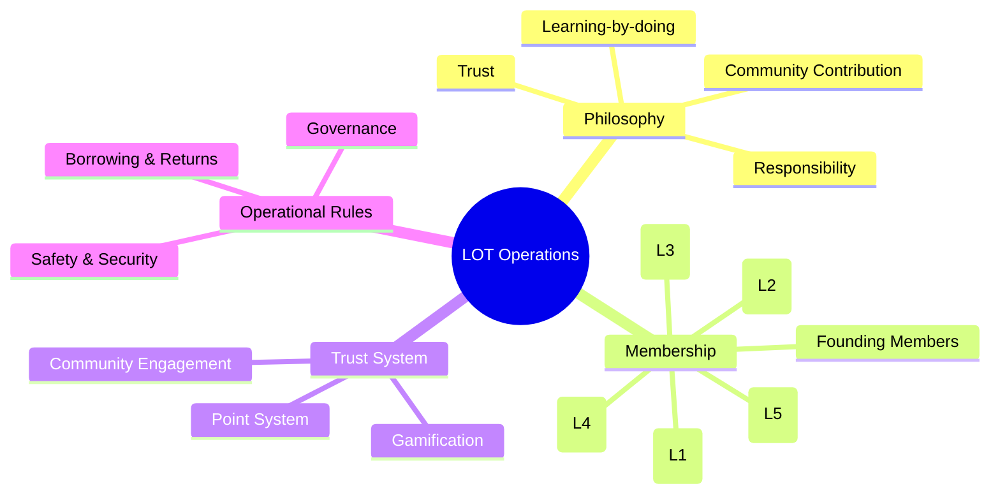
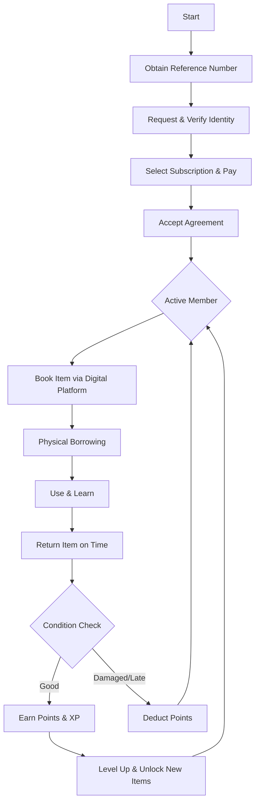

# Library of Things (LOT) - Operational Manual

Welcome to the official operational manual for the Library of Things (LOT). This repository contains the guidelines, rules, and frameworks that govern our community-driven shared resource platform.

## 🧠 LOT Operations Mind Map

The following mind map illustrates the core pillars and structure of the LOT ecosystem.

## 🔄 The LOT Journey: Joining & Borrowing

This flowchart demonstrates the process of becoming a member and utilizing the library's resources.

## 📊 Membership Levels at a Glance

| Level | Role | Access Overview |
| :--- | :--- | :--- |
| **1** | **Explorer** | Basic LEGO kits, Common tools, Low-cost DIY items. |
| **2** | **Maker** | IoT starter kits, Sensors, Power tools, Hand tools. |
| **3** | **Builder** | Robotics kits, RC systems, Advanced electronics. |
| **4** | **Innovator** | Drones, 3D printers, High-demand tools. |
| **5** | **Advanced Lab** | Professional equipment, Research tools. |

---

For detailed rules and governance, please refer to the [Full Operational Manual](lot_manual.md).
